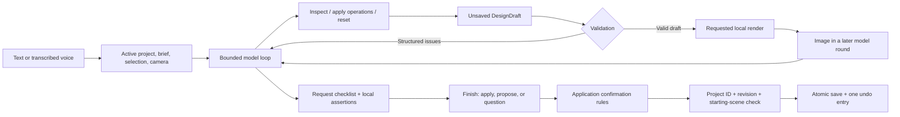

# Design engine and agent harness

Terrain keeps architectural editing independent of the model provider and transport. The agent chooses operations; local code owns their geometry, validation, rendering, and commit rules. Separate projects keep conversations and design requirements from leaking into a new house.

## Request and commit lifecycle



The browser flushes pending saves before starting a run and supplies its project ID, revision, and scene. The server checks them against the active project, then creates a draft. The model sees the inspected house and brief, up to ten messages from that house, selected room or surface, view, and camera. Its tools affect only a `DesignDraft`.

`runAgent` uses an injected `AgentModel.complete(messages, signal?)` interface. Production uses Gateway Chat Completions; tests inject model turns without network calls. After a valid finish, `/api/agent` returns a draft ID. The UI commits modest edits automatically and holds proposals for confirmation. Spoken replies follow successful handling; speech failure does not roll back a committed design.

Visual review is enabled by default in the browser and stored as a browser preference. The API enables it only when the request explicitly sets `context.allowVisualReview` and supplies an available renderer. When enabled, a changed draft cannot finish until the model receives an image of that exact draft in a later round. Editing again invalidates the earlier review. Turning visual review off permits numerical validation without image uploads; it does not disable local previews.

## Architectural model and selection

`shared/model.ts` keeps version-1 project compatibility. A project has its own identity/name, revision, scene, conversation, alternatives, and undo/redo history. Rooms have stable IDs, purpose, center, elevation, dimensions, four base wall types, optional room/surface palettes, optional roof configuration, and optional dimensioned wall openings. Units are meters: x points east, z south, elevation up.

`DesignSelection` in `shared/selection.ts` is `{ roomId, surface, furnitureId? }`, where surface is `room`, `north`, `south`, `east`, `west`, `floor`, or `roof`. Furniture selection uses `surface: 'room'` and a piece ID scoped to that room. Three-dimensional picking, floor-plan controls, and the inspector use this same identity. The harness rejects missing rooms/pieces, invalid surfaces, and disagreement between `selection.roomId` and the legacy `selectedRoomId` field. Material precedence is surface → room → house; furniture overrides independently inherit room/house palettes. A whole-room or whole-house palette command clears applicable surface overrides.

Optional `scene.design` metadata contains:

- **Groups:** room IDs that should move together, such as a bedroom/bathroom wing.
- **Connections:** two room IDs, shared side, world-space opening center, width, height, and door/open kind. North/south centers use world x; east/west centers use world z.
- **Stair links:** stair ID plus lower and upper landing room IDs.
- **Requirements:** ID, description, source (`confirmed`, `assumption`, `preference`), and typed rule.

Requirements support connectivity (including whether outdoor routes count), symmetry, locked position/size/height/material/roof/openings, overlook, and freeform intent. Lock snapshots are engine-owned: roof locks capture resolved defaults/overrides, and opening locks capture resolved apertures and base wall flags, including the opposite face of a shared aperture. Resubmitting a lock cannot rebase its protected snapshot. Confirmed geometric violations are errors; assumptions/preferences produce warnings. Intent text informs the model but is not machine-checked. Removing or changing an existing confirmed/assumed requirement in an agent draft requires review, including requirements recorded before rooms exist.

Missing legacy revisions default to zero; missing `design` means empty metadata. Empty and absent metadata compare equal for no-op detection. Legacy door flags retain centered openings, and aligned legacy passages can contribute to circulation. Explicit commands introduce metadata; room names are not used to guess relationships.

### Roofs

Scene defaults are `roof: 'flat' | 'pitched' | 'single-pitch'`, optional `roofPitch` in degrees, and optional `roofDirection`. A room can override them with `roof: { style, pitch?, direction? }`. `pitched` remains a symmetric gable. For `single-pitch`, direction names the **high edge**, not the downhill edge; for a gable it identifies the slope axis. `Room.height` is the minimum eave above the room floor. Roof rise is additional, and pitch is bounded to 1–60 degrees.

`shared/architecture.ts` provides `effectiveRoof`, `roofRise`, `roofHeightAt`, and `roofMaximumHeight`. The height function accepts world x/z and returns nominal world roof elevation, extending the same plane outside the footprint for overhangs. Render thickness is separate. New configured house roofs default to 20 degrees and north. An old unconfigured `pitched` scene retains its original z-running ridge and rise `min(2.5, width × 0.22)`; loading it does not rewrite its geometry.

`set_roof { style, pitch?, direction?, roomIds? }` edits house defaults when room IDs are omitted, preserving room overrides. With IDs it sets those room roofs. `reset_roof { roomIds }` removes the overrides and restores inheritance. The UI's **House roof default**, **Room roof**, **Apply roof**, and **Use house default** controls use these same commands.

### Dimensioned apertures

`Room.wallOpenings` stores `{ id, side, kind, offset, width, height, sill }` records. Kind is `window`, `door`, or `open`; offset is the center relative to the room center, along world +x for north/south walls and +z for east/west walls. Dimensions and sill are meters above the room floor. Doors/open passages must have sill zero, width at least 0.75 m, and height at least 2 m. Windows never create a circulation edge. Validation checks wall extent, the roof profile at the aperture head, overlapping rectangles, distinct IDs, and shared-wall conflicts. A high wall can support a clerestory that would not fit below the minimum eave on the low wall.

`set_wall_openings { roomId, side, openings }` takes the complete desired standalone set for that side; entries omit `side`. It replaces existing standalone apertures on that physical wall portion, including apertures viewed from their opposite face. It preserves `design.connections` passage doors. An empty list clears standalone apertures and restores a solid base unless a semantic connection remains. `update_room` with a wall flag also replaces that wall's standalone apertures. The UI displays explicit openings in **Windows & doors**, while semantic connected passages are shown separately.

`shared/openings.ts` provides `roomOpenings(scene, roomId, side)`, which returns dimensions plus `source: 'explicit' | 'connection'` and `sourceRoomId`. Each standalone aperture has one stored owner; a matching opposite-face aperture is derived at the adjacent room's local offset/sill. This avoids duplicate geometry records that can drift apart. Openings move with their owning room; anchored resizing preserves their along-wall world center and reports an error if they no longer fit. It does not silently shrink or delete them. Split-level windows can mirror when the complete aperture fits both wall faces; a raised opposite-face doorway also requires a stair relationship.

Legacy whole-wall flags remain the fallback when there are no resolved apertures on that side: `glass` spans the wall, `door` is centered, and `open` removes the wall. Semantic `connection.kind: 'open'` uses one common physical aperture capped at the lower adjacent ceiling/roof, regardless of its stored height. Both room faces resolve the same rectangle; saved connection metadata and IDs remain unchanged. An explicit standalone `kind: 'open'` respects its supplied height. Supplying an optional `connectionId` to `connect_rooms` creates or updates that particular passage, allowing multiple distinct doors between the same pair; omitting it retains the original pair-update behavior.

## Commands and validation

### Furniture

`shared/furniture.ts` resolves optional `Room.furniture` records with stable room-local IDs, kind/name, x/z position in meters, rotation in degrees, dimensions, and optional palette. Yaw 0 faces south; +90 faces east. Missing arrays use legacy generated positions without rewriting the project; `[]` means deliberately empty. The first furniture edit materializes all existing pieces. Draft inspection also reports added, removed and changed furniture IDs relative to the saved baseline, so later model rounds can distinguish an edited draft from the original layout. Room moves carry them once because positions are local. 3D meshes, SVG plans, selection and inspection share this model.

`add_furniture {roomId, items}`, `update_furniture {roomId, furnitureId, patch}`, `remove_furniture {roomId, furnitureIds}`, and `arrange_furniture {roomIds}` use the same command contract as architecture. The catalog in `inspectDesign` provides default dimensions. Update can also replace a piece's kind/dimensions while retaining its ID. IDs must be unique within a room; explicit solid pieces exceeding room bounds or height block commit. Rugs are decorative and exempt. Legacy generated fit problems remain advisory so unrelated edits do not force a furnishing migration.

`shared/furniture-layout.ts` performs a bounded deterministic search over positions and cardinal orientations. It preserves inventory, dimensions, material, and architecture, prioritizes room fit, overlaps, doors/open passages, stairs and circulation, then balances a sofa/coffee-table group. Rugs follow the sofa. Unsolvable layouts keep their pieces and report remaining issues. Arbitrarily rotated bounds are conservative axis-aligned boxes; this is not a general interior-design or pedestrian-path solver.

The `furniture_layout` assessment checks room fit, collisions, doorway obstructions and stair conflicts; `furniture_item` checks existence and optional exact position/orientation/dimensions. A false required claim triggers proposal review through the normal assessment policy. Furniture can also be protected by a `locked` requirement with `properties: ['furniture']`; snapshots record resolved pieces and cannot be rebased by repeating the lock. Saves, history, alternatives and the existing transport-independent draft service require no furniture-specific storage or MCP adapter.

### Architectural operations

`shared/design.ts` exports Zod schemas, `executeCommands`, `inspectDesign`, `validateDesign`, and `validateDesignChange`. These have no HTTP, provider, browser, or filesystem dependencies. Model tools and the control API generate JSON Schema from the same definitions.

| Operation family         | Commands                                                                                         |
| ------------------------ | ------------------------------------------------------------------------------------------------ |
| Rooms                    | `add_rooms`, `update_room`, `remove_objects`                                                     |
| Assemblies and placement | `define_group`, `remove_group`, `move_group`, `attach_room`, `attach_wing`                       |
| Dimensions and openings  | `resize_room`, `move_wall`, `connect_rooms`, `disconnect_rooms`, `set_wall_openings`             |
| Appearance and site      | `set_roof`, `reset_roof`, `set_material`, `set_surface_material`, `update_site`, `set_fireplace` |
| Levels                   | `add_stairs`, `link_stairs`, `connect_levels`                                                    |
| Furniture                | `add_furniture`, `update_furniture`, `remove_furniture`, `arrange_furniture`                     |
| Brief                    | `set_requirement`, `remove_requirement`                                                          |

Attachment aligns a room with a target edge and optionally creates a shared opening. `elevationOffset` is relative to the target floor and defaults to zero; a deliberate split-level attachment uses `connect: false` followed by linked stairs. Anchored resizing keeps the requested edge fixed and can move connected assemblies. `move_wall` takes a room ID, wall side, and signed delta: positive moves outward, negative inward, with the opposite wall fixed. Movement preserves groups and updates relevant relationships. These are deterministic editing algorithms, not a general constraint solver. An impossible placement returns a conflict rather than searching arbitrary layouts.

A batch is atomic on schema, lookup, or command failure: earlier operations from that batch roll back. A syntactically valid batch with geometric conflicts remains in the temporary draft for repair. Validation returns issue codes, severity, affected IDs, and measurements/details. Only valid changed states become previews; unresolved errors prevent commit.

Checks include dimensions, unique IDs, enclosed-volume overlap, opening alignment/extent, room/group references, stair endpoints and landing widths, circulation, and typed requirements. A stair crossing an adjacent wall must have a real aperture at its crossing position, with the flight's full width and 2 m of headroom above the upper landing. A doorway elsewhere on that wall does not satisfy the check. Automatic stairs use the actual sloping roof height at their landing. Change validation also rejects broken existing indoor routes, new disconnected interior rooms, and introduced unlinked stairs/misaligned doors. Existing unresolved legacy warnings can remain during unrelated edits. Confirmed outdoor-access requirements may permit actual courtyard routes for named rooms; an intent note alone cannot establish a connection.

`shared/examples.ts` exports `hillsideHouse()`, used by **Load sample house**. It builds the original brief through the same commands: a double-height living space and central chimney, an upper kitchen platform, a room below the kitchen, symmetric attached upper/lower bedroom and bathroom wings, two courtyards, and four linked flights. Confirmed connectivity, symmetry, and overlook requirements accompany the fixture. Schematic furnishing advisories remain visible. The older `sampleScene()` remains a legacy fixture for compatibility tests.

### Spatial advisories

`shared/spatial.ts` inspects bounding boxes matching the schematic furniture meshes, doorway approaches/assumed swings, sampled stair headroom, and linked landing areas. These findings are warnings marked `advisory: true`, with the measurement and assumption included. Current design assumptions are:

| Check                 | Assumption                                                                                        |
| --------------------- | ------------------------------------------------------------------------------------------------- |
| Furniture circulation | 0.6 m around listed usable sides; 0.9 m at kitchen work areas                                     |
| Door approach         | 0.9 m inward depth, centered width limited to the opening or 0.9 m                                |
| Door swing            | One inward leaf as wide as the opening; report obstruction when both possible hinge sides collide |
| Stair headroom        | 2 m above sampled treads; verified linked floor/ceiling cutouts are excluded                      |
| Stair landing         | 0.9 m clear depth beyond the flight inside its linked room                                        |

These are concept checks, not building-code or accessibility certification. Actual door handing/leaf count, detailed furnishings, structure, irregular walls, and a complete pedestrian path planner are not represented. Advisory warnings do not become hard failures merely because a new design creates them.

The renderer subtracts explicit aperture rectangles on both walls and in the floor plan. Roof caps are clipped around high apertures too; only `window` apertures receive glass. Each room owns the inward half of its shared wall so opposite faces can have different finishes and be selected independently. Stair links determine slab holes; stacked rooms suppress covered roofs/foundations. Partially covered sloping roofs use flat exposed patches. Rectangular volumes, conservative stair cutouts, roof joins, and terrain/foundation interaction remain concept geometry.

## Agent tools and bounds

| Tool               | Behavior                                                                                       |
| ------------------ | ---------------------------------------------------------------------------------------------- |
| `inspect_design`   | Geometry, relationships, components, requirements, and issues; optional room IDs provide focus |
| `apply_operations` | Up to 40 semantic commands in an unsaved draft; exact changes and validation feedback          |
| `render_view`      | A fresh image of the valid draft, using the connected local render provider                    |
| `reset_draft`      | Restore the starting scene and clear draft errors/previews                                     |
| `review_design`    | Evaluate a request checklist and typed assertions against the current draft                    |
| `finish_design`    | Concise reply, request assessment, and `apply`, `propose`, or `question` intent                |

`apply` and `propose` require real changes and a valid draft. `question` requires an unchanged draft. Saying “done” without edits cannot bypass these rules. Application confirmation is independent of model intent: removing any room, changing area by more than 35% in an existing house, or changing protected existing requirements triggers review. The model can request review for smaller edits too.

`render_view` accepts exterior, interior, cutaway, or plan; optional room/floor focus, angle, quality (`live`, `clay`, `wireframe`), lighting, and an explicit camera. Interior requests require a room. Captures are rejected for invalid drafts or unknown rooms. A request returns camera, view, dimensions, and a scene fingerprint; the image is supplied separately to the next model round. Finishing in the capture round, or after further unreviewed edits, is rejected when visual review is enabled.

The prompt prioritizes confirmed intent, stable IDs, small related edits, geometry inspection, accurate claims, and selection-grounded language. It distinguishes screen-relative directions from world axes. Names, notes, images, and tool content are treated as data.

### Request assessment and efficient context

The provider-facing `finish_design` schema requires an assessment: stable request IDs, required/preference priority, fulfilled/partial/unmet/unverified status, evidence, limitations, assumptions, and optional typed checks. `shared/assessment.ts` evaluates room existence/dimensions, resolved roof shape/pitch/direction, wall opening side/count/minimum dimensions, materials, and indoor routes. A failed check cannot remain fulfilled merely because the model says so. Unfulfilled required items or consequential assumptions force confirmation, and the application appends an explicit disclosure to the reply.

`review_design` can evaluate a checklist before finishing. Once reviewed, required priorities, checks, IDs, and consequential assumptions cannot be dropped to manufacture success; they must be repaired or disclosed. Legacy injected in-process model adapters may still omit an assessment when no checklist has been reviewed. Checklist completeness still depends on the model's interpretation of the request: this is not a deterministic natural-language requirements parser, and an unchecked aesthetic claim is labeled a model judgment.

Empty-site creation requires `plan_design` before operations. A composition declares a complete room program, material strategy, dimensioned exterior fenestration, features and review views; an explicit single-space creation can use a focused plan. `server/design-planning.ts` turns this into immutable objectives, reserves capacity for missing requirements, and evaluates intent coverage separately from the builder’s declared program. Existing focused edits do not require a composition plan. `shared/design-quality.ts` adds conservative exterior-window exposure, material-composition, room-program and feature assertions. See [design quality](design-quality.md) for evidence limits.

`critique_design` invokes a separate skeptical model context containing the original request, immutable plan, current inspection and eligible current-scene images. Only `submit_design_critique` is available to that call; critique cannot dispatch operations. Planned compositions require current whole-scene exterior and layout evidence when visual review is enabled. Feedback must arrive in a later builder round before finish. A repair invalidates the critique and visual approval. Required supported work cannot finish early merely because geometry is valid; exhausted bounds or unsupported requirements produce explicit limitations and proposal review. With images disabled, the critic receives facts only and cannot certify appearance.

`server/agent-history.ts` removes repeated `scene`/`inspection`/`quality` payloads from older matched geometry-tool results after snapshot refresh, preserving the full latest tool turn while retaining call/result pairings, changes, failures, and other evidence. A current authoritative house/brief/validation snapshot replaces the original snapshot before each model call. Validated current-draft image pixels remain available through inspection, checklist review, and finish; stale images retire while their hash/view provenance remains. The initial viewport image retires after its first model call. An exact scene fingerprint plus canonical render request keys a per-run capture cache; a repeated identical view reuses its existing pixel message, or supplies it again if it was retired. The three-capture focused-edit limit, or six-capture planned-composition limit, bounds retained distinct views. Editing invalidates the earlier approval even when a later edit restores the same fingerprint. Reuse does not bypass the later-round visual-review requirement or make image input tokens free.

With visual review enabled, a changed draft also requires explicit `finish_design.visualReview`: capture IDs, a `passed`/`issues`/`unverified` status, observations, and optional limitations. IDs must reference images delivered in a later model round and match the final draft hash. Appearance changes and newly added rooms require relevant Live 3D color evidence, using matching room scope or a whole-scene view; a plan, Clay or Wireframe image alone cannot satisfy that review. Changed roofs specifically require exterior evidence. A selected wall's interior preset must face toward that wall. Capture provenance establishes the source and camera, not visibility through occlusion or objective visual correctness. These observations are model judgments and supplement numerical assertions. Issues or an inconclusive review are disclosed and require confirmation. The UI shows the reviewed views and observations in **Latest design check**. Turning visual review off suppresses image transmission and produces no visual judgment.

Successful results include `RunMetrics`: harness elapsed time, model time, tool time, render time, tool/capture/reuse counts, message-context characters, removed duplicate characters, and approximate decoded image bytes sent. Render time is a subset of tool time, so those durations must not be added together. Context counts cover messages, not tool schemas; bytes/characters are not provider token counts. Provider-reported tokens/costs remain in the separate usage object.

Default bounds are twelve actual model calls for focused runs or twenty after the first accepted composition plan (including independent critique), thirty-two tool calls, two geometry repair opportunities, three focused-edit or six planned-composition review captures, 6,000 output tokens per response, and a five-minute server timeout. Provider tool schemas use an explicit object root with optional fields rather than a top-level union; runtime parsing still enforces exclusive variants. Critique requests receive an application-owned objective manifest that fixes observation count and allowed IDs; local validation also rejects omissions and duplicates. Sonnet 5.5 critique-only calls use low adaptive reasoning effort within the same 6,000-token output cap; builder and other model calls keep their prior settings. Provider failures and responses without tool calls terminate the attempt. A truncated response is accounted, then discarded in full before tool-envelope parsing, protocol-history insertion or execution. At most one recovery adds application-authored guidance for a smaller connected batch while retaining the original request and earlier valid draft work. It consumes the existing model-call allowance and an idle round; cancellation, a second truncation, exhausted calls or the no-progress limit terminate recovery. Geometry repair, truncation recovery and visual review can require extra paid model calls. Local operations and rendering have no provider cost; images sent to the model consume image input tokens. Daily accounting counts every model round, transcription, and speech request; its `modelCost` field aggregates known design and audio charges. Unknown charges are omitted from that daily sum. Any unknown model charge makes the reported design-run total unknown. Disconnecting an audio request aborts its provider request; a provider that finishes despite cancellation still has its reported cost recorded.

Before every model call, a system message refreshes the remaining model/tool/capture/repair budget, draft status, blocking errors, and visual-review state. In the final three calls it explicitly prioritizes essential repairs, a fresh final capture when needed, then review and finish; optional polishing should stop. This is model guidance, while the call limits and finish validation remain enforced in code. Explicit `maxCalls` overrides remain strict. When enough calls remain after repair and fresh image delivery, guidance directs current-scene independent critique before finish.

A separate guard stops a run before another paid call after three consecutive rounds without progress. Progress means reaching a previously unseen scene fingerprint, reducing the blocking-error count, completing a new capture, or receiving a new scene image for review. Repeated inspections, unchanged edits, repeated cached captures of an already reviewed scene, and revisiting an earlier draft do not reset the counter by themselves. A valid finish returns immediately, including a clarification with an unchanged empty draft; it does not trigger the stall guard. A stalled or exhausted run leaves saved geometry unchanged.

One agent run or alternative-generation request is active per server. Duplicate run IDs are rejected. The UI polls progress and can cancel through an abort signal; disconnecting a request also cancels it. Failure/cancellation discards its draft without changing saved geometry. Messages and usage accounting may still be saved.

## Local render provider and broker

The transport-independent interface is:

```ts
type RenderProvider = (
  scene: Scene,
  request: RenderRequest,
  signal?: AbortSignal,
) => Promise<RenderCaptureResult>;
```

`RenderBroker` in `server/render-service.ts` implements this through a connected browser. `src/useRenderBridge.ts` registers a client and maintains a 15-second lease through bounded long polling. `GET /api/render/jobs?clientId=…&wait=1&afterId=…` waits up to ten seconds or returns immediately when the pending job changes; the browser immediately starts the next wait. `afterId` prevents redelivering the currently running capture as a new job. Disconnect/cancellation releases the wait, and one active wait is permitted per client. This avoids relying on a browser interval to notice new work in a background tab. Plain polling remains available without `wait=1`.

`src/RenderCapture.tsx` renders separately from the user viewport: 3D captures reuse `SceneView` architecture/environment in an offscreen 768×576 canvas; plan captures rasterize the shared floor-plan SVG. Captures do not move the user's camera or edit the project.

The offscreen 3D canvas uses a fixed-size React Three Fiber root with automatic frames disabled. `captureAfterRender` schedules two explicit draws through `MessageChannel` tasks (a zero-delay timer is the fallback), then captures pixels without waiting for `requestAnimationFrame` or `ResizeObserver`. Context loss, no draw calls, and transparent/empty image data fail the capture. Each capture releases its root when finished; the browser must still be running and able to execute tasks.

A `RenderJob` contains `id`, immutable `scene`, `sceneHash`, and `request`. The result contains a PNG/JPEG data URL, dimensions, camera position/target, scene hash, and view. The broker checks job ownership and validates the returned metadata against the requested scene, view, and deterministic camera. Expired, disconnected, or cancelled jobs cannot satisfy a later request. The broker timeout is 60 seconds; the browser capture has its own shorter timeout. Render data is transient unless it becomes a saved alternative thumbnail.

Keep the browser tab open and the local renderer available. There is no headless provider yet. A future headless implementation can satisfy `RenderProvider` without changing model tools, draft rules, or alternative generation. The numerical-only preview test scripts do not require a renderer.

## Visual alternatives and preference memory

`AlternativeService` generates two or three options independently from the same saved scene. Each option goes through the bounded model harness and change validation. Earlier candidates are supplied as context so later options can differ. Geometry/material signatures reject no-op options and duplicates; renaming a room or adding a note is insufficient to create a distinct option.

After generation, a shared camera frames the union of option extents. Each thumbnail uses that camera, lighting, and render mode, making scale comparisons consistent. Thumbnail generation requires a local renderer regardless of the visual-review setting. Thumbnails stay local. Image transmission to the model during option design occurs only if visual review is enabled.

Generation returns an in-memory choice set; it does not save geometry, alternatives, or preference notes. The user can inspect a preview and explicitly choose. Acceptance checks project identity, revision, the original scene fingerprint, and validation again. It applies one option as one undo entry, saves all options with thumbnails/descriptions, appends the choice to that project's conversation, and records an `intent` requirement with `source: 'preference'`. An optional explanation refines the preference; it is not a geometric lock or model fine-tuning.

Choice sets expire after 30 minutes and disappear on restart; up to twelve sets are retained. The generated options count toward the project's 30-alternative limit. Duplicate acceptance is idempotent within the process and cannot apply to a different active project. Generation shares the server's active-agent lock and has a ten-minute timeout; cancellation applies none of the partial candidates. Two/three options can use up to forty/sixty model calls for planned compositions (twenty-four/thirty-six for focused options), subject to the daily quota.

## Project library, persistence, and concurrent changes

`ProjectStore` serializes atomic writes to `.data/workspace.json`. It contains the active project ID and up to 100 project documents. Each project has independent geometry, brief, messages, undo/redo history, and alternatives. Create/open operations compare the current active project ID and revision, then atomically change the active pointer. New projects start empty, including conversation and history; existing projects are retained intact. Browser switching flushes pending work and clears selection, comparisons, pending results, and camera context.

Migration from `.data/project.json` is lazy. If `workspace.json` is absent, the old file supplies the original project, with a stable fallback ID of `original`. Merely reading does not rewrite it. The first write, creation, or switch creates the workspace file and leaves the legacy file untouched. Once present, `workspace.json` is authoritative. Corrupt files raise errors rather than silently replacing the library. Project JSON import/export remains scoped to the active house; imports retain its local project identity. Backing up `workspace.json` preserves the full library.

`DesignService` owns draft creation, inspection, operations, discard, and commit. Up to 32 drafts live in memory for 30 minutes. A draft is bound to its original project and scene. Commit checks active project ID, expected revision, and whether the saved scene still matches the draft's starting scene. A message-only save may advance the revision without invalidating the scene, but callers must use the latest revision. A fresh revision cannot authorize an old draft to overwrite a changed house.

All accepted operations in a draft become one scene change and one undo entry. Confirmation is checked again at commit. Duplicate commits reuse an in-memory result/promise; the last 64 commit records are retained. Idempotency is process-local, not a durable cross-restart request ledger. Retrying a committed draft returns the latest matching project without reapplying geometry.

The browser also uses `PUT /api/project` for manual edits, conversations/history, imports, and restoring alternatives. This path checks document validity, absolute scene validity, active project ID, and revision. It does not impose every before/after automation policy: explicitly restoring an old alternative may remove later rooms or requirements. Automated adapters must use semantic drafts instead of whole-project overwrite. The browser save queue preserves newer local edits while an earlier save is in flight; conflicts retain local work and offer export/reload.

Other local files hold connections, daily usage, and diagnostic run summaries. Summaries include stages, issues, changes, model/usage, and render metadata, but omit keys, image data, audio, and private reasoning. They may contain room names and design details. Generated thumbnail data is stored with saved alternatives; transient review captures are not diagnostic assets. This is not a complete event-sourced project journal.

## HTTP controls and future MCP integration

`server/app.ts` adapts services to local HTTP. `server/index.ts` adds loopback binding and Vite/static hosting. `GET /api/design/capabilities` advertises control version **2** and the operation JSON Schema. `GET /api/project` supplies the active `projectId` and `revision`; carry both through operations that target that project.

| Endpoint                                 | Input / result                                                                           |
| ---------------------------------------- | ---------------------------------------------------------------------------------------- |
| `GET /api/projects`                      | `{activeProjectId, projects: [{id, name, rooms, revision}]}`                             |
| `POST /api/projects`                     | `{name, expectedProjectId, expectedRevision}` → `{project}`; create and open a new house |
| `POST /api/projects/:id/open`            | `{expectedProjectId, expectedRevision}` → `{project}`                                    |
| `GET /api/project`                       | Active project document                                                                  |
| `PUT /api/project`                       | Full document including `projectId` and latest `revision` → `{ok, project}`              |
| `POST /api/design/inspect`               | Active revision and inspected scene                                                      |
| `POST /api/design/drafts`                | `{projectId, baseRevision}` → draft description                                          |
| `GET /api/design/drafts/:id`             | Project identity, scene, issues, changes, readiness, confirmation requirement            |
| `POST /api/design/drafts/:id/operations` | `{operations: [...]}` → updated draft description                                        |
| `POST /api/design/drafts/:id/commit`     | `{expectedRevision, confirm}` → persisted project/reply/changes/issues                   |
| `DELETE /api/design/drafts/:id`          | Discard an uncommitted draft                                                             |

Normal `POST /api/agent` requests require `projectId`, `baseRevision`, `scene`, and `messages`; a UUID `runId` and `context` are optional. Context accepts selection, view/camera, and `{renderClientId, allowVisualReview}`. Compatibility fields `selectedRoomId` and an initial image remain accepted, but the current UI sends no initial screenshot. `previewOnly: true` permits a supplied synthetic scene without project identity or a committable draft. `GET /api/agent/runs/:id` exposes progress; `POST /api/agent/runs/:id/cancel` aborts an active run.

| Rendering endpoint                                 | Input / result                                                                         |
| -------------------------------------------------- | -------------------------------------------------------------------------------------- |
| `POST /api/render/clients`                         | `{clientId}` registration                                                              |
| `GET /api/render/jobs?clientId=…&wait=1&afterId=…` | Bounded job wait/lease heartbeat and `{job: RenderJob \| null}`; optional wait/afterId |
| `POST /api/render/jobs/:id/result`                 | `{clientId, result}` or `{clientId, error}`                                            |
| `DELETE /api/render/clients/:id`                   | Disconnect and cancel outstanding captures                                             |

| Alternatives endpoint             | Input / result                                                                                     |
| --------------------------------- | -------------------------------------------------------------------------------------------------- |
| `POST /api/alternatives/generate` | `{projectId, baseRevision, prompt, count: 2 \| 3, renderClientId, context?}` → `AlternativeResult` |
| `POST /api/alternatives/choose`   | `{projectId, expectedRevision, choiceSetId, optionId, preferenceText?}` → `{project}`              |

`AlternativeResult` includes `choiceSetId`, `projectId`, `baseRevision`, options, and usage. Each option includes ID, name, description, scene, thumbnail data URL, issues, and changes. These IDs are opaque and cannot be moved between houses. Project/revision conflicts return HTTP 409 with `code: 'revision_conflict'`; other 409 errors, such as an active run or required confirmation, must not be treated as stale-project conflicts. Confirmation cannot override invalid geometry.

A future MCP adapter can expose project discovery/opening, inspection, semantic drafts, render requests, and alternatives through the same services and schemas. It must preserve project identity, revisions, confirmation, cancellation, privacy settings, and error contracts. It should not implement geometry independently or expose raw project overwrite as an editing shortcut. Provider selection stays behind `AgentModel`, and image production behind `RenderProvider`. **No MCP server, endpoint, or remote-agent authentication layer is implemented.**

## Verification

Unit and mocked integration tests cover semantic edits, selection/surface materials, spatial assumptions, visual evidence freshness, broker ownership/cancellation, alternative distinctness and acceptance, project migration/isolation, save races, and rendering geometry. HTTP tests run an isolated loopback application with injected models and temporary storage. They make no paid provider requests.

`scripts/scenario-server.ts` is an explicit no-cloud entry point for browser scenarios. Run `SCENARIO_RUN=manual-check SCENARIO_PORT=5186 npx tsx scripts/scenario-server.ts`; it binds to loopback and uses `.data/verification/manual-check`. It does not load `.env`. Model turns and audio adapters are injected, while the application, storage, geometry, validation, renderer, and HTTP lifecycle remain real. Its verification-only endpoints queue scripted turns (`POST /__verification/turns`), reset the isolated active fixture (`POST /__verification/reset`), or request a capture (`POST /__verification/render`). Unqueued model calls fail; the audio adapter returns configured text and silent WAV data, so it does not test voice quality. These endpoints are absent from the production entry point.

`npx tsx scripts/benchmark.ts` warms the local engine and reports median/p95 inspection, material-edit, and scene-fingerprint times for the cabin, hillside, and stress fixtures in `scripts/scenarios.ts`. It uses no cloud calls or browser/GPU rendering. These numerical measurements do not describe complete model, capture, speech, or user-interaction latency. Verification outcomes and measured results are recorded separately from this contract documentation.

`npm run verify:gateway -- --live` exercises Gateway audio and preview-only design. `npm run verify:design -- --live --case selected` checks selected-room material editing; `attach`, `empty`, `resize`, and `all` cover additional synthetic scenarios. These paid scripts use numerical-only previews, report request usage, and verify that the saved project stays unchanged. Live editing, visual-review, and alternative-selection checks should use a separate `TERRAIN_DATA_DIR` and an attached browser to preserve the user's working library.


Current live-gate evidence: 398 tests and the production build passed before a small delivery-barrier follow-up. Fresh isolated `t1SRko` produced an honest ten-space partial in fourteen calls; no edits followed final captures, but current-scene re-critique was skipped. The latest guidance and six-capture allowance await a fresh complete result. See [verification status](design-quality.md#verification) for the cumulative approved budget and evidence limits. Running backend `2401911` remains separate from local `3561eff` plus pending fixes.
