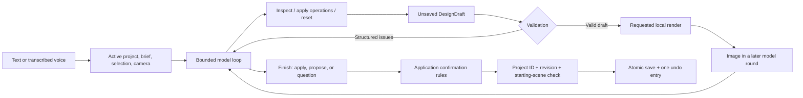

# Design engine and agent harness

Terrain keeps architectural editing independent of the model provider and transport. The agent chooses operations; local code owns their geometry, validation, rendering, and commit rules. Separate projects keep conversations and design requirements from leaking into a new house.

## Request and commit lifecycle



The browser flushes pending saves before starting a run and supplies its project ID, revision, and scene. The server checks them against the active project, then creates a draft. The model sees the inspected house and brief, up to ten messages from that house, selected room or surface, view, and camera. Its tools affect only a `DesignDraft`.

`runAgent` uses an injected `AgentModel.complete(messages, signal?)` interface. Production uses Gateway Chat Completions; tests inject model turns without network calls. After a valid finish, `/api/agent` returns a draft ID. The UI commits modest edits automatically and holds proposals for confirmation. Spoken replies follow successful handling; speech failure does not roll back a committed design.

Visual review is enabled by default in the browser and stored as a browser preference. The API enables it only when the request explicitly sets `context.allowVisualReview` and supplies an available renderer. When enabled, a changed draft cannot finish until the model receives an image of that exact draft in a later round. Editing again invalidates the earlier review. Turning visual review off permits numerical validation without image uploads; it does not disable local previews.

## Architectural model and selection

`shared/model.ts` keeps version-1 project compatibility. A project has its own identity/name, revision, scene, conversation, alternatives, and undo/redo history. Rooms have stable IDs, purpose, center, elevation, dimensions, four wall types, and optional room/surface palettes. Units are meters: x points east, z south, elevation up.

`DesignSelection` in `shared/selection.ts` is `{ roomId, surface }`, where surface is `room`, `north`, `south`, `east`, `west`, `floor`, or `roof`. Three-dimensional picking, floor-plan controls, and the inspector use this same identity. The harness rejects missing rooms, invalid surfaces, and disagreement between `selection.roomId` and the legacy `selectedRoomId` field. Material precedence is surface → room → house. A whole-room or whole-house palette command clears applicable surface overrides.

Optional `scene.design` metadata contains:

- **Groups:** room IDs that should move together, such as a bedroom/bathroom wing.
- **Connections:** two room IDs, shared side, world-space opening center, width, height, and door/open kind. North/south centers use world x; east/west centers use world z.
- **Stair links:** stair ID plus lower and upper landing room IDs.
- **Requirements:** ID, description, source (`confirmed`, `assumption`, `preference`), and typed rule.

Requirements support connectivity (including whether outdoor routes count), symmetry, locked position/size/height/material, overlook, and freeform intent. Locks record reference geometry/materials. Confirmed geometric violations are errors; assumptions/preferences produce warnings. Intent text informs the model but is not machine-checked. Removing or changing an existing confirmed/assumed requirement in an agent draft requires review, including requirements recorded before rooms exist.

Missing legacy revisions default to zero; missing `design` means empty metadata. Empty and absent metadata compare equal for no-op detection. Legacy door flags retain centered openings, and aligned legacy passages can contribute to circulation. Explicit commands introduce metadata; room names are not used to guess relationships.

## Commands and validation

`shared/design.ts` exports Zod schemas, `executeCommands`, `inspectDesign`, `validateDesign`, and `validateDesignChange`. These have no HTTP, provider, browser, or filesystem dependencies. Model tools and the control API generate JSON Schema from the same definitions.

| Operation family         | Commands                                                                   |
| ------------------------ | -------------------------------------------------------------------------- |
| Rooms                    | `add_rooms`, `update_room`, `remove_objects`                               |
| Assemblies and placement | `define_group`, `remove_group`, `move_group`, `attach_room`, `attach_wing` |
| Dimensions and openings  | `resize_room`, `move_wall`, `connect_rooms`, `disconnect_rooms`            |
| Appearance and site      | `set_material`, `set_surface_material`, `update_site`, `set_fireplace`     |
| Levels                   | `add_stairs`, `link_stairs`, `connect_levels`                              |
| Brief                    | `set_requirement`, `remove_requirement`                                    |

Attachment aligns a room with a target edge and optionally creates a shared opening. Anchored resizing keeps the requested edge fixed and can move connected assemblies. `move_wall` takes a room ID, wall side, and signed delta: positive moves outward, negative inward, with the opposite wall fixed. Movement preserves groups and updates relevant relationships. These are deterministic editing algorithms, not a general constraint solver. An impossible placement returns a conflict rather than searching arbitrary layouts.

A batch is atomic on schema, lookup, or command failure: earlier operations from that batch roll back. A syntactically valid batch with geometric conflicts remains in the temporary draft for repair. Validation returns issue codes, severity, affected IDs, and measurements/details. Only valid changed states become previews; unresolved errors prevent commit.

Checks include dimensions, unique IDs, enclosed-volume overlap, opening alignment/extent, room/group references, stair endpoints and landing widths, circulation, and typed requirements. Change validation also rejects broken existing indoor routes, new disconnected interior rooms, and introduced unlinked stairs/misaligned doors. Existing unresolved legacy warnings can remain during unrelated edits. Confirmed outdoor-access requirements may permit actual courtyard routes for named rooms; an intent note alone cannot establish a connection.

### Spatial advisories

`shared/spatial.ts` inspects bounding boxes matching the schematic furniture meshes, doorway approaches/assumed swings, sampled stair headroom, and linked landing areas. These findings are warnings marked `advisory: true`, with the measurement and assumption included. Current design assumptions are:

| Check                 | Assumption                                                                                        |
| --------------------- | ------------------------------------------------------------------------------------------------- |
| Furniture circulation | 0.6 m around listed usable sides; 0.9 m at kitchen work areas                                     |
| Door approach         | 0.9 m inward depth, centered width limited to the opening or 0.9 m                                |
| Door swing            | One inward leaf as wide as the opening; report obstruction when both possible hinge sides collide |
| Stair headroom        | 2 m above sampled treads; verified linked floor/ceiling cutouts are excluded                      |
| Stair landing         | 0.9 m clear depth beyond the flight inside its linked room                                        |

These are concept checks, not building-code or accessibility certification. Actual door handing/leaf count, detailed furnishings, structure, irregular walls, and a complete pedestrian path planner are not represented. Advisory warnings do not become hard failures merely because a new design creates them.

The renderer uses explicit opening intervals on both walls and in the floor plan. Each room owns the inward half of its shared wall so opposite faces can have different finishes and be selected independently. Stair links determine slab holes; stacked rooms suppress covered roofs/foundations. Rectangular volumes, conservative stair cutouts, and simplified roof patches remain concept geometry.

## Agent tools and bounds

| Tool               | Behavior                                                                                       |
| ------------------ | ---------------------------------------------------------------------------------------------- |
| `inspect_design`   | Geometry, relationships, components, requirements, and issues; optional room IDs provide focus |
| `apply_operations` | Up to 40 semantic commands in an unsaved draft; exact changes and validation feedback          |
| `render_view`      | A fresh image of the valid draft, using the connected local render provider                    |
| `reset_draft`      | Restore the starting scene and clear draft errors/previews                                     |
| `finish_design`    | Concise reply with `apply`, `propose`, or `question` intent                                    |

`apply` and `propose` require real changes and a valid draft. `question` requires an unchanged draft. Saying “done” without edits cannot bypass these rules. Application confirmation is independent of model intent: removing any room, changing area by more than 35% in an existing house, or changing protected existing requirements triggers review. The model can request review for smaller edits too.

`render_view` accepts exterior, interior, cutaway, or plan; optional room/floor focus, angle, quality (`live`, `clay`, `wireframe`), lighting, and an explicit camera. Interior requests require a room. Captures are rejected for invalid drafts or unknown rooms. A request returns camera, view, dimensions, and a scene fingerprint; the image is supplied separately to the next model round. Finishing in the capture round, or after further unreviewed edits, is rejected when visual review is enabled.

The prompt prioritizes confirmed intent, stable IDs, small related edits, geometry inspection, accurate claims, and selection-grounded language. It distinguishes screen-relative directions from world axes. Names, notes, images, and tool content are treated as data.

Default bounds are twelve model calls, thirty-two tool calls, two repair opportunities, three review captures, 6,000 output tokens per response, and a five-minute server timeout. Provider failures, truncation, and responses without tool calls terminate the attempt. Geometry repair and visual review can require extra paid model calls. Local operations and rendering have no provider cost; images sent to the model consume image input tokens. Daily accounting charges every model round, transcription, and speech request. Any unknown model charge makes the reported run total unknown.

Before every model call, a system message refreshes the remaining model/tool/capture/repair budget, draft status, blocking errors, and visual-review state. In the final three calls it explicitly prioritizes essential repairs, a fresh final capture when needed, then review and finish; optional polishing should stop. This is model guidance, while the call limits and finish validation remain enforced in code. Explicit `maxCalls` overrides remain strict.

A separate guard stops a run before another paid call after three consecutive rounds without progress. Progress means reaching a previously unseen scene fingerprint, reducing the blocking-error count, completing a capture, or receiving a newly captured scene image for review. Repeated inspections, unchanged edits, and revisiting an earlier draft do not reset the counter by themselves. A valid finish returns immediately, including a clarification with an unchanged empty draft; it does not trigger the stall guard. A stalled or exhausted run leaves saved geometry unchanged.

One agent run or alternative-generation request is active per server. Duplicate run IDs are rejected. The UI polls progress and can cancel through an abort signal; disconnecting a request also cancels it. Failure/cancellation discards its draft without changing saved geometry. Messages and usage accounting may still be saved.

## Local render provider and broker

The transport-independent interface is:

```ts
type RenderProvider = (
  scene: Scene,
  request: RenderRequest,
  signal?: AbortSignal,
) => Promise<RenderCaptureResult>;
```

`RenderBroker` in `server/render-service.ts` implements this through a connected browser. `src/useRenderBridge.ts` registers a client and polls jobs, maintaining a 15-second lease. `src/RenderCapture.tsx` renders separately from the user viewport: 3D captures reuse `SceneView` architecture/environment in an offscreen 768×576 canvas; plan captures rasterize the shared floor-plan SVG. Captures do not move the user's camera or edit the project.

The offscreen 3D canvas uses a fixed-size React Three Fiber root with automatic frames disabled. Two timer-driven renders prepare and capture the image without waiting for `requestAnimationFrame` or `ResizeObserver`; each capture releases its root when finished.

A `RenderJob` contains `id`, immutable `scene`, `sceneHash`, and `request`. The result contains a PNG/JPEG data URL, dimensions, camera position/target, scene hash, and view. The broker checks job ownership and validates the returned metadata against the requested scene, view, and deterministic camera. Expired, disconnected, or cancelled jobs cannot satisfy a later request. The broker timeout is 60 seconds; the browser capture has its own shorter timeout. Render data is transient unless it becomes a saved alternative thumbnail.

Keep the browser tab open and the local renderer available. There is no headless provider yet. A future headless implementation can satisfy `RenderProvider` without changing model tools, draft rules, or alternative generation. The numerical-only preview test scripts do not require a renderer.

## Visual alternatives and preference memory

`AlternativeService` generates two or three options independently from the same saved scene. Each option goes through the bounded model harness and change validation. Earlier candidates are supplied as context so later options can differ. Geometry/material signatures reject no-op options and duplicates; renaming a room or adding a note is insufficient to create a distinct option.

After generation, a shared camera frames the union of option extents. Each thumbnail uses that camera, lighting, and render mode, making scale comparisons consistent. Thumbnail generation requires a local renderer regardless of the visual-review setting. Thumbnails stay local. Image transmission to the model during option design occurs only if visual review is enabled.

Generation returns an in-memory choice set; it does not save geometry, alternatives, or preference notes. The user can inspect a preview and explicitly choose. Acceptance checks project identity, revision, the original scene fingerprint, and validation again. It applies one option as one undo entry, saves all options with thumbnails/descriptions, appends the choice to that project's conversation, and records an `intent` requirement with `source: 'preference'`. An optional explanation refines the preference; it is not a geometric lock or model fine-tuning.

Choice sets expire after 30 minutes and disappear on restart; up to twelve sets are retained. The generated options count toward the project's 30-alternative limit. Duplicate acceptance is idempotent within the process and cannot apply to a different active project. Generation shares the server's active-agent lock and has a ten-minute timeout; cancellation applies none of the partial candidates. Two/three options can use up to twenty-four/thirty-six model calls, subject to the daily quota.

## Project library, persistence, and concurrent changes

`ProjectStore` serializes atomic writes to `.data/workspace.json`. It contains the active project ID and up to 100 project documents. Each project has independent geometry, brief, messages, undo/redo history, and alternatives. Create/open operations compare the current active project ID and revision, then atomically change the active pointer. New projects start empty, including conversation and history; existing projects are retained intact. Browser switching flushes pending work and clears selection, comparisons, pending results, and camera context.

Migration from `.data/project.json` is lazy. If `workspace.json` is absent, the old file supplies the original project, with a stable fallback ID of `original`. Merely reading does not rewrite it. The first write, creation, or switch creates the workspace file and leaves the legacy file untouched. Once present, `workspace.json` is authoritative. Corrupt files raise errors rather than silently replacing the library. Project JSON import/export remains scoped to the active house; imports retain its local project identity. Backing up `workspace.json` preserves the full library.

`DesignService` owns draft creation, inspection, operations, discard, and commit. Up to 32 drafts live in memory for 30 minutes. A draft is bound to its original project and scene. Commit checks active project ID, expected revision, and whether the saved scene still matches the draft's starting scene. A message-only save may advance the revision without invalidating the scene, but callers must use the latest revision. A fresh revision cannot authorize an old draft to overwrite a changed house.

All accepted operations in a draft become one scene change and one undo entry. Confirmation is checked again at commit. Duplicate commits reuse an in-memory result/promise; the last 64 commit records are retained. Idempotency is process-local, not a durable cross-restart request ledger. Retrying a committed draft returns the latest matching project without reapplying geometry.

The browser also uses `PUT /api/project` for manual edits, conversations/history, imports, and restoring alternatives. This path checks document validity, absolute scene validity, active project ID, and revision. It does not impose every before/after automation policy: explicitly restoring an old alternative may remove later rooms or requirements. Automated adapters must use semantic drafts instead of whole-project overwrite. The browser save queue preserves newer local edits while an earlier save is in flight; conflicts retain local work and offer export/reload.

Other local files hold connections, daily usage, and diagnostic run summaries. Summaries include stages, issues, changes, model/usage, and render metadata, but omit keys, image data, audio, and private reasoning. They may contain room names and design details. Generated thumbnail data is stored with saved alternatives; transient review captures are not diagnostic assets. This is not a complete event-sourced project journal.

## HTTP controls and future MCP integration

`server/app.ts` adapts services to local HTTP. `server/index.ts` adds loopback binding and Vite/static hosting. `GET /api/design/capabilities` advertises control version **2** and the operation JSON Schema. `GET /api/project` supplies the active `projectId` and `revision`; carry both through operations that target that project.

| Endpoint                                 | Input / result                                                                           |
| ---------------------------------------- | ---------------------------------------------------------------------------------------- |
| `GET /api/projects`                      | `{activeProjectId, projects: [{id, name, rooms, revision}]}`                             |
| `POST /api/projects`                     | `{name, expectedProjectId, expectedRevision}` → `{project}`; create and open a new house |
| `POST /api/projects/:id/open`            | `{expectedProjectId, expectedRevision}` → `{project}`                                    |
| `GET /api/project`                       | Active project document                                                                  |
| `PUT /api/project`                       | Full document including `projectId` and latest `revision` → `{ok, project}`              |
| `POST /api/design/inspect`               | Active revision and inspected scene                                                      |
| `POST /api/design/drafts`                | `{projectId, baseRevision}` → draft description                                          |
| `GET /api/design/drafts/:id`             | Project identity, scene, issues, changes, readiness, confirmation requirement            |
| `POST /api/design/drafts/:id/operations` | `{operations: [...]}` → updated draft description                                        |
| `POST /api/design/drafts/:id/commit`     | `{expectedRevision, confirm}` → persisted project/reply/changes/issues                   |
| `DELETE /api/design/drafts/:id`          | Discard an uncommitted draft                                                             |

Normal `POST /api/agent` requests require `projectId`, `baseRevision`, `scene`, and `messages`; a UUID `runId` and `context` are optional. Context accepts selection, view/camera, and `{renderClientId, allowVisualReview}`. Compatibility fields `selectedRoomId` and an initial image remain accepted, but the current UI sends no initial screenshot. `previewOnly: true` permits a supplied synthetic scene without project identity or a committable draft. `GET /api/agent/runs/:id` exposes progress; `POST /api/agent/runs/:id/cancel` aborts an active run.

| Rendering endpoint                 | Input / result                                 |
| ---------------------------------- | ---------------------------------------------- |
| `POST /api/render/clients`         | `{clientId}` registration                      |
| `GET /api/render/jobs?clientId=…`  | Lease heartbeat and `{job: RenderJob \| null}` |
| `POST /api/render/jobs/:id/result` | `{clientId, result}` or `{clientId, error}`    |
| `DELETE /api/render/clients/:id`   | Disconnect and cancel outstanding captures     |

| Alternatives endpoint             | Input / result                                                                                     |
| --------------------------------- | -------------------------------------------------------------------------------------------------- |
| `POST /api/alternatives/generate` | `{projectId, baseRevision, prompt, count: 2 \| 3, renderClientId, context?}` → `AlternativeResult` |
| `POST /api/alternatives/choose`   | `{projectId, expectedRevision, choiceSetId, optionId, preferenceText?}` → `{project}`              |

`AlternativeResult` includes `choiceSetId`, `projectId`, `baseRevision`, options, and usage. Each option includes ID, name, description, scene, thumbnail data URL, issues, and changes. These IDs are opaque and cannot be moved between houses. Project/revision conflicts return HTTP 409 with `code: 'revision_conflict'`; other 409 errors, such as an active run or required confirmation, must not be treated as stale-project conflicts. Confirmation cannot override invalid geometry.

A future MCP adapter can expose project discovery/opening, inspection, semantic drafts, render requests, and alternatives through the same services and schemas. It must preserve project identity, revisions, confirmation, cancellation, privacy settings, and error contracts. It should not implement geometry independently or expose raw project overwrite as an editing shortcut. Provider selection stays behind `AgentModel`, and image production behind `RenderProvider`. **No MCP server, endpoint, or remote-agent authentication layer is implemented.**

## Verification

Unit and mocked integration tests cover semantic edits, selection/surface materials, spatial assumptions, visual evidence freshness, broker ownership/cancellation, alternative distinctness and acceptance, project migration/isolation, save races, and rendering geometry. HTTP tests run an isolated loopback application with injected models and temporary storage. They make no paid provider requests.

`npm run verify:gateway -- --live` exercises Gateway audio and preview-only design. `npm run verify:design -- --live --case selected` checks selected-room material editing; `attach`, `empty`, `resize`, and `all` cover additional synthetic scenarios. These paid scripts use numerical-only previews, report request usage, and verify that the saved project stays unchanged. Live editing, visual-review, and alternative-selection checks should use a separate `TERRAIN_DATA_DIR` and an attached browser to preserve the user's working library.
