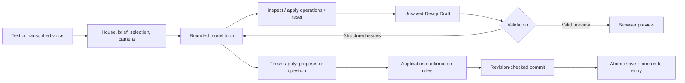

# Design engine and agent harness

Terrain keeps architectural editing independent of the model provider and transport. Sonnet chooses operations; local code owns their geometry, validation, and commit rules. The browser renders a scene derived from that same model.

## Request and commit lifecycle

The browser flushes pending saves before starting a run and supplies its revision and scene. The server checks both against disk, then creates a draft. The model sees the inspected house and brief, up to ten recent messages, selected room ID, view, and camera. An optional house viewport image is supplied separately as image input; it is disabled by default and never captures the desktop.

`runAgent` uses an injected `AgentModel` interface. Its production adapter sends Gateway Chat Completions tool calls. Tests inject model turns without network calls. Tools affect only a `DesignDraft`. After a valid finish, `/api/agent` returns a draft ID. The UI commits modest edits automatically and holds proposals for confirmation. Spoken replies occur after the result is handled; speech failure does not roll back a committed design.

## Architectural model

`shared/model.ts` keeps version-1 project compatibility. Rooms have stable IDs, purpose, center, elevation, dimensions, four wall types, and optional palette overrides. Units are meters: x points east, z south, elevation up.

Optional `scene.design` metadata contains:

- **Groups:** room IDs that should move together, such as a bedroom/bathroom wing.
- **Connections:** two room IDs, shared side, world-space opening center, width, height, and door/open kind. North/south centers use world x; east/west centers use world z.
- **Stair links:** stair ID plus lower and upper landing room IDs.
- **Requirements:** ID, description, source (`confirmed`, `assumption`, `preference`), and typed rule.

Requirement kinds are connectivity (including whether outdoor routes count), symmetry, locked position/size/height/material, overlook, and freeform intent. Locks store reference geometry. Confirmed geometric violations are errors; assumptions/preferences produce warnings. Intent text informs the model but is not machine-checked. Removing or changing an existing confirmed/assumed requirement in an agent draft requires review, including requirements recorded before the first rooms exist.

Missing legacy revisions default to zero; missing `design` means empty metadata. Empty and absent metadata compare equal for no-op detection. Legacy door flags retain centered openings, and aligned legacy passages can contribute to circulation. Explicit commands introduce metadata; room names are not used to guess relationships.

## Commands and validation

`shared/design.ts` exports Zod schemas, `executeCommands`, `inspectDesign`, `validateDesign`, and `validateDesignChange`. They have no HTTP, provider, browser, or filesystem dependencies. Model tools and the control API generate JSON Schema from the same definitions.

| Operation family         | Commands                                                                   |
| ------------------------ | -------------------------------------------------------------------------- |
| Rooms                    | `add_rooms`, `update_room`, `remove_objects`                               |
| Assemblies and placement | `define_group`, `remove_group`, `move_group`, `attach_room`, `attach_wing` |
| Dimensions and openings  | `resize_room`, `connect_rooms`, `disconnect_rooms`                         |
| Appearance and site      | `set_material`, `update_site`, `set_fireplace`                             |
| Levels                   | `add_stairs`, `link_stairs`, `connect_levels`                              |
| Brief                    | `set_requirement`, `remove_requirement`                                    |

Attachment aligns a room with a chosen target edge and optionally creates a shared opening. Anchored resizing keeps the requested edge fixed and can move connected assemblies. Movement preserves groups and updates relevant explicit relationships. These are deterministic editing algorithms, not a general constraint solver. An impossible placement returns a conflict rather than searching arbitrary layouts.

A batch is atomic on schema, lookup, or command failure: earlier operations from that batch roll back. A syntactically valid batch with geometric conflicts remains in the temporary draft for repair. Validation returns issue codes, severity, affected object IDs, and useful measurements/details. Only valid changed states become previews; unresolved errors prevent commit.

Checks include dimensions, unique IDs, enclosed-volume overlap, opening alignment/extent, room/group references, stair endpoints and landing widths, circulation, and typed requirements. Change validation also rejects broken existing indoor routes, new disconnected interior rooms, and introduced unlinked stairs/misaligned doors. Existing unresolved legacy warnings can remain during unrelated edits. Confirmed outdoor-access requirements may permit actual courtyard routes for named rooms; a note alone cannot establish a connection.

The renderer uses explicit opening intervals on both walls and in the floor plan. Room palettes override the house palette. Stair links determine slab holes, and stacked rooms suppress covered roofs/foundations. Rectangular volumes, conservative stair cutouts, and simplified roof patches remain concept geometry. Detailed wall joins, arbitrary polygons, structural analysis, full stair safety, and collision navigation are outside current guarantees.

## Agent tools and bounds

| Tool               | Behavior                                                                                                   |
| ------------------ | ---------------------------------------------------------------------------------------------------------- |
| `inspect_design`   | Returns geometry, relationships, connected components, and issues; optional room IDs provide focus context |
| `apply_operations` | Applies up to 40 commands to the unsaved draft and returns exact changes and validation feedback           |
| `reset_draft`      | Restores the starting scene and clears draft errors/previews                                               |
| `finish_design`    | Returns a concise reply with `apply`, `propose`, or `question` intent                                      |

`apply` and `propose` require real changes and a valid draft. `question` requires an unchanged draft. Saying “done” without edits cannot bypass these rules. Application confirmation is independent of model intent: removing any room, changing area by more than 35% in an existing house, or changing protected existing requirements triggers review. The model can request review for smaller edits too.

The prompt prioritizes confirmed intent, stable IDs, small related edits, geometry inspection, and accurate descriptions of executed operations. It distinguishes screen-relative language from world axes and asks the model to explain significant assumptions. User-supplied names/notes and tool content are treated as data.

Default bounds are six model calls, twenty tool calls, two repair opportunities after rejected results, 6,000 output tokens per model response, and a five-minute server timeout. Provider failures, truncation, and responses without tool calls terminate the attempt. Geometry repair uses extra paid model calls. The daily cloud-request cap is charged before each model round, transcription, and speech request. Usage aggregates reported tokens/cost; an unknown model charge keeps the run total unknown. Local tools have no provider cost.

One agent run is active per server. Duplicate run IDs are rejected. The UI polls progress and can cancel through an abort signal; disconnecting the request also cancels it. Failure/cancellation clears the preview and discards the draft without changing saved geometry. Messages and usage accounting may still be saved.

## Persistence and concurrent changes

`DesignService` owns draft creation, inspection, operations, discard, and commit. Up to 32 drafts live in memory and expire after 30 minutes. Restarting drops uncommitted drafts.

`ProjectStore` serializes atomic writes and increments the revision on each save. Commit checks both the expected revision and whether the saved scene still matches the draft's starting scene. A message-only save may advance the revision without invalidating the scene, but callers must use the latest revision. Providing a fresh revision for an old draft cannot overwrite a changed house.

All accepted operations in a draft become one scene change and one undo entry. Confirmation is checked again at commit. Duplicate commits reuse an in-memory result/promise; the last 64 commit records are retained. Idempotency is scoped to the running process, not a durable cross-restart request ledger. Retrying a committed draft returns the latest project without reapplying geometry.

The browser also uses `PUT /api/project` for complete document saves: manual edits, conversation/history updates, imports, and restoring alternatives. This path checks the document, absolute scene validity, and expected revision. It deliberately does not apply every before/after automation policy: explicitly restoring an older version may remove later rooms or requirements. Automated adapters must use the draft/commit service rather than treating whole-project replacement as an editing tool. A future MCP surface should not expose raw project overwrite as a substitute for semantic operations.

Local files contain project/history, connection settings, daily usage, and diagnostic run summaries. Summaries record stages, issues, changes, selected model, and available usage/errors. They omit keys, images, audio, and private model reasoning, but can contain room names and design details. They are not a complete event-sourced project journal.

## Transport and future MCP integration

`server/app.ts` adapts the service to local HTTP. `server/index.ts` adds loopback binding and Vite/static hosting. Design controls work without model calls:

| Endpoint                                 | Input / result                                                           |
| ---------------------------------------- | ------------------------------------------------------------------------ |
| `GET /api/design/capabilities`           | Version and operation JSON Schema                                        |
| `POST /api/design/inspect`               | Saved revision and inspected scene                                       |
| `POST /api/design/drafts`                | `{ "baseRevision": n }` → draft description                              |
| `GET /api/design/drafts/:id`             | Scene, issues, changes, readiness, confirmation requirement              |
| `POST /api/design/drafts/:id/operations` | `{ "operations": [...] }` → updated draft description                    |
| `POST /api/design/drafts/:id/commit`     | `{ "expectedRevision": n, "confirm": false }` → persisted project/result |
| `DELETE /api/design/drafts/:id`          | Discard an uncommitted draft                                             |

`POST /api/agent` accepts `scene`, `messages`, `baseRevision`, optional `context`, and an optional UUID `runId`. It returns a `HarnessResult` and a draft ID for changed proposals. `previewOnly: true` runs on the supplied scene without creating a committable stored draft. `GET /api/agent/runs/:id` exposes progress; `POST /api/agent/runs/:id/cancel` aborts an active run. Revision conflicts return HTTP 409; confirmation cannot override invalid geometry.

A future MCP adapter can expose discovery, inspection, operations, and commit through `DesignService` and the exported schemas. It should preserve revision, validation, confirmation, cancellation, and error contracts instead of creating another geometry implementation or editing project JSON directly. Provider selection stays behind `AgentModel`. **No MCP server, endpoint, or remote agent authentication layer is implemented.**

## Verification

Unit tests cover geometry/requirements, draft repair, no-op detection, renderer intervals/slabs, and storage. Mocked harness tests exercise malformed arguments, geometry feedback, cancellation, bounds, selection, and confirmation. HTTP tests use an isolated loopback application, injected model, and temporary storage to check progress, quotas, conflicts, and unchanged saved projects before commit.

`npm run verify:gateway -- --live` exercises actual Gateway audio and preview-only design. `npm run verify:design -- --live --case selected` exercises a selected-room material edit; `attach`, `empty`, `resize`, and `all` select additional synthetic scenarios. These paid checks report actual request usage and verify unchanged saved projects. Any live editing/commit scenarios should use a separate `TERRAIN_DATA_DIR` to preserve the user's working house.
